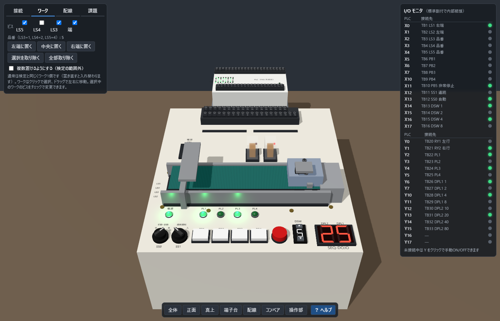
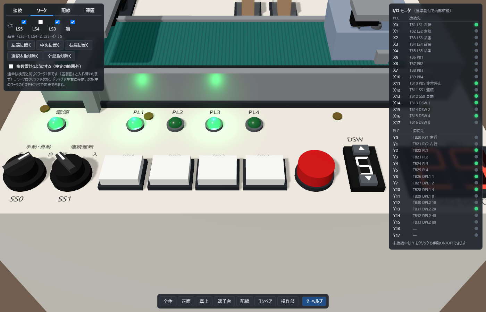
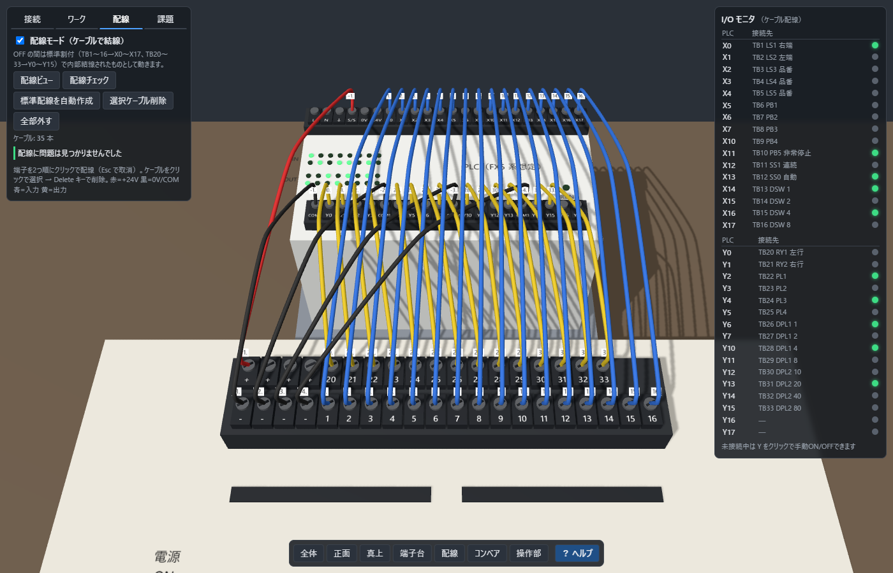
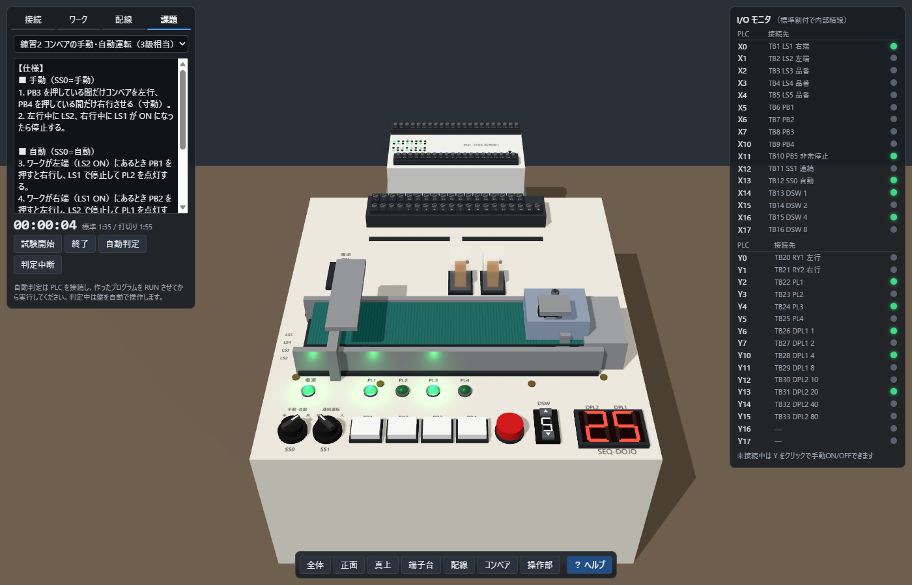

# シーケンス道場 3D

<p align="center"></p>

技能検定［シーケンス制御作業］の実技（製作等作業試験）の練習用に、**検定作業盤を 3D で再現**した PC アプリです。
三菱 MELSEC（SLMP）・KEYENCE KV（上位リンク）・Modbus TCP の PLC（実機またはシミュレータ）と通信し、自分で書いたラダープログラムで 3D の作業盤を動かせます。

- 作業盤をマウスでぐりぐり回して、スイッチ操作・ランプ・7セグ・コンベアの動きを確認できる
- 作業盤の端子台と PLC の端子を 3D 上でケーブル配線する練習ができる（誤配線チェック付き）
- 検定風の課題を試験タイマー付きで解き、動作を自動判定できる
- 接続設定や配線をファイル（`*.sdojo`）に保存して、あとで開き直せる

## 画面イメージ

| 作業盤の全体 | 操作部 |
|---|---|
|  |  |
| **配線モード**（端子台と PLC をケーブルで結線） | **課題モード**（試験タイマーと自動判定） |
|  |  |

## 動作環境

| 項目 | 内容 |
|---|---|
| OS | Windows 10 / 11（64 bit） |
| 画面表示 | Microsoft Edge WebView2 ランタイム（Windows 11 には標準で入っています） |
| ビルドする場合 | .NET SDK 9.0 以上（`dotnet --list-sdks` で確認） |
| PLC | 三菱 MELSEC（SLMP: iQ-F / iQ-R / iQ-L / MX / Q / L、GX Simulator 3）<br>KEYENCE KV（上位リンク: KV-NANO / 3000 / 5000 / 7000 / 8000 / X500、KV STUDIO シミュレータ）<br>Modbus TCP 対応機器 |

## すぐに使う

1. `run.bat` をダブルクリックします。ビルドしてから、アプリのウィンドウ（シーケンス道場 3D）が開きます。
2. PLC が無くても、I/O モニタの出力の行をクリックすれば手動で ON/OFF して盤の動きを確認できます。
3. PLC とつなぐ場合は、左の「接続」タブに IP・ポートなどを入力して「接続」を押します。
   PLC 側の設定は [docs/plc-setup.md](docs/plc-setup.md) を参照してください。

ウィンドウを閉じるとアプリは終了します（PLC との通信も止まります）。常駐するプロセスはありません。

### 配布用の exe を作る

`build.bat` を実行すると、**1 ファイルの exe**（`publish\win-x64-single\SequenceDojo.exe`、約 60MB）ができます。
.NET と画面ファイルを exe に含めているので、配布先の PC に .NET をインストールする必要はありません。
`SequenceDojo.exe` だけをコピーしてダブルクリックで起動します。詳しくは [docs/build.md](docs/build.md) を参照してください。

GitHub Releases への公開（ZIP の作成と VirusTotal 検査）は、バージョンタグの push で GitHub Actions が行います。手順は [docs/releasing.md](docs/releasing.md) を参照してください。

### 仕組み

アプリの中で小さな Web サーバー（127.0.0.1 のみで待ち受け）を動かし、ウィンドウ内の WebView2 に画面を表示しています。
PC の外からは接続できません。ポート 5087 が使用中の場合は、自動で空いているポートを使います。

## ドキュメント

| ドキュメント | 内容 |
|---|---|
| [docs/usage.md](docs/usage.md) | 画面の見方と操作方法（3D 操作、各タブ、I/O モニタ） |
| [docs/panel-spec.md](docs/panel-spec.md) | 再現している作業盤の仕様と I/O 割付 |
| [docs/plc-setup.md](docs/plc-setup.md) | PLC・GX Simulator との接続設定 |
| [docs/wiring.md](docs/wiring.md) | 配線モードの使い方と回路計算・配線チェックの規則 |
| [docs/tasks.md](docs/tasks.md) | 課題モードと課題ファイル（JSON）の書き方 |
| [docs/architecture.md](docs/architecture.md) | ソフトウェア構成、通信仕様、開発者向け情報 |
| [docs/build.md](docs/build.md) | ビルド・開発（配布用 exe の作成） |
| [docs/releasing.md](docs/releasing.md) | リリースと VirusTotal 検査 |

## フォルダ構成

```
sequence-dojo/
├─ SequenceDojo.sln        ソリューション
├─ run.bat                 ビルドして起動
├─ build.bat               配布用の 1 ファイル exe（publish\win-x64-single）を作成
├─ CHANGELOG.md            変更履歴
├─ .github/                リリース用の GitHub Actions と VirusTotal 検査スクリプト
├─ tests/release/          検査スクリプトのテスト
├─ README.md
├─ docs/                   ドキュメント
└─ src/
   └─ SequenceDojo/        Windows アプリ（.NET 9、WinForms + WebView2 + ASP.NET Core）
      ├─ Program.cs        起動処理（サーバー起動 → ウィンドウ表示 → 終了時に停止）
      ├─ MainForm.cs       メインウィンドウ（WebView2 で画面を表示）
      ├─ ProjectFiles.cs   プロジェクトファイル（*.sdojo）の保存・読込
      ├─ WebServer.cs      アプリ内 Web サーバー・WebSocket
      ├─ PlcService.cs     PLC 通信の周期ループ
      ├─ Plc/              通信方式ごとの実装（SlmpLink / HostLinkLink / ModbusLink）
      ├─ app.ico           アプリのアイコン
      └─ wwwroot/          画面（HTML / JavaScript / Three.js）
         ├─ index.html
         ├─ css/style.css
         ├─ js/
         │  ├─ app.js      作業盤モデル・操作・シミュレーション・UI
         │  ├─ gfx.js      3D 形状・文字のヘルパ
         │  ├─ wiring.js   配線モード（PLC モデル・ケーブル・回路計算）
         │  └─ tasks.js    課題モード（タイマー・自動判定）
         ├─ tasks/         課題ファイル（JSON）
         └─ vendor/        Three.js（r170）
```

## 使用ライブラリ

- [PlcComm.Slmp](https://plc-comm-docs-site.fa-labo.com/package-matrix/)（NuGet）: 三菱 MELSEC の SLMP 通信
- [PlcComm.KvHostLink](https://plc-comm-docs-site.fa-labo.com/package-matrix/)（NuGet）: KEYENCE KV の上位リンク通信
- [AMWD.Protocols.Modbus.Tcp](https://github.com/AM-WD/AMWD.Protocols.Modbus)（NuGet）: Modbus TCP 通信
- [Three.js](https://threejs.org/) r170: 3D 描画（`wwwroot/vendor` に同梱。オフラインで動作）
- [Microsoft Edge WebView2](https://learn.microsoft.com/microsoft-edge/webview2/)（NuGet: Microsoft.Web.WebView2）: ウィンドウ内での画面表示

## ライセンス

[MIT License](LICENSE)

使用しているライブラリのライセンスは [THIRD-PARTY-NOTICES.md](THIRD-PARTY-NOTICES.md) を参照してください。

## 注意

- 本ソフトは個人が作成した練習用のシミュレータです。作業盤メーカー、PLC メーカー、中央職業能力開発協会とは関係ありません。
- 記載している製品名・シリーズ名は、各社の商標または登録商標です。
- 実際の作業盤・検定会場の機材とは細部が異なります。
- 同梱の課題はオリジナルの練習課題で、実際の検定課題ではありません。最新の試験情報は中央職業能力開発協会の公表資料で確認してください。
